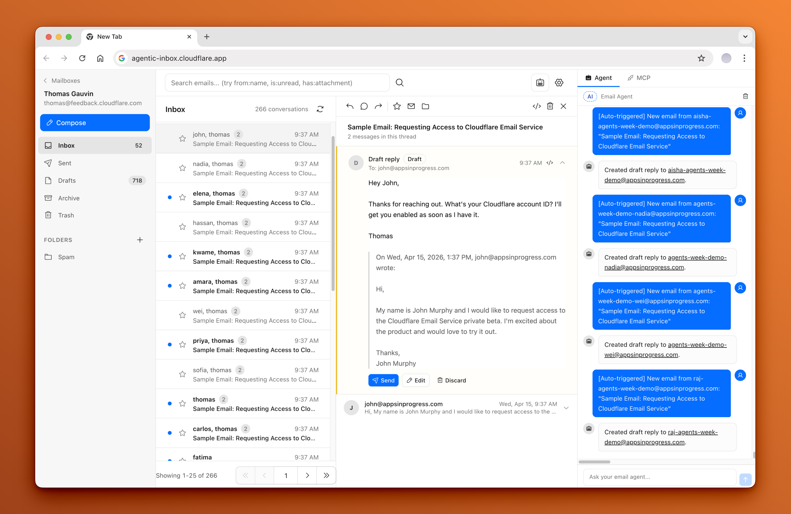

<div align="center">
  <h1>VSBG Box</h1>
  <p><em>Internal email client on Cloudflare Workers — with an AI agent, MCP server, and team conversation layer.</em></p>
</div>

VSBG Box is VSBG's internal email client — a fork of Cloudflare's
[agentic-inbox](https://github.com/cloudflare/agentic-inbox), re-skinned, scoped
down, and operated for company use on the **`vsbg.vn`** domain. Single Cloudflare
Worker (`vsbg-box`), React 19 + React Router v7 SSR frontend, Hono API, three
Durable Objects (mailbox, agent, MCP), and one R2 bucket for attachments and
settings.

Incoming mail arrives via [Cloudflare Email Routing](https://developers.cloudflare.com/email-routing/),
each mailbox is isolated in its own [Durable Object](https://developers.cloudflare.com/durable-objects/)
with a SQLite database, attachments live in [R2](https://developers.cloudflare.com/r2/),
and an **AI Email Agent** (built on the [Cloudflare Agents SDK](https://developers.cloudflare.com/agents/)
and [Workers AI](https://developers.cloudflare.com/workers-ai/)) auto-drafts
replies, with a [Model Context Protocol](https://modelcontextprotocol.io/) server
at `/mcp` for external AI clients.

**App:** `https://box.vsbg.vn` &nbsp;·&nbsp; **Landing:** `https://start.vsbg.vn`



---

## Features

- **Full email client** — send, receive, reply, threaded conversations, folders (system + custom), Gmail-style search, attachments, sandboxed HTML rendering. **Internal-only delivery** by design — external recipients are blocked at the API.
- **AI email agent** — sidebar chat with 13 email tools (read, search, draft, send, conversation state, internal notes), auto-draft on inbound mail with prompt-injection scan, draft verification, explicit user confirmation before send.
- **MCP server** — 20 tools at `/mcp` for external AI clients (Claude Code, Cursor, ProtoAgent).
- **Team conversation layer** — conversation state (status/priority/assignee/needs_reply), private internal notes, event timeline, social graph of contacts.
- **Per-mailbox isolation** — every mailbox runs in its own Durable Object with SQLite + R2.
- **Vietnamese UI** — chat-style UX, not a Gmail clone.

## Stack

| Layer | Tech |
|---|---|
| Frontend | React 19, React Router v7 (SSR), Tailwind CSS v4, Zustand, TanStack Query v5, TipTap (pinned 3.20.2), `@cloudflare/kumo`, Phosphor icons |
| Backend | Hono, Cloudflare Workers, Durable Objects (SQLite), R2, Email Routing + Email Service |
| AI | Cloudflare Agents SDK (`AIChatAgent`), AI SDK v6, Workers AI (`@cf/moonshotai/kimi-k2.5` chat, `llama-3.1-8b-instruct-fast` injection check, `llama-4-scout` draft verify) |
| Auth | **Cloudflare Access JWT validation** (single trust boundary — no cookies, no sessions, no JWT issuance in app code) |

---

## Quick Start (Local Dev)

```bash
# 1. Install
npm install

# 2. Create the local R2 bucket (one-time)
wrangler r2 bucket create vsbg-box-local

# 3. (Optional) copy dev vars
cp .dev.vars.example .dev.vars

# 4. Start the dev server
npm run dev          # → http://localhost:5173
```

In dev, the worker trusts the `x-dev-user-email` header (no Access needed).
Set it in your browser's dev tools, or leave it empty to impersonate
`admin@vsbg.vn` (if it's in `EMAIL_ADDRESSES`).

```bash
npm test             # node --test tests/*.test.ts   →  7 files, 33 tests
npm run typecheck    # wrangler types && react-router typegen && tsc -b
```

Full walkthrough: [`docs/deployment-guide.md`](./docs/deployment-guide.md).

---

## Environment Variables

| Name | Kind | Example | Purpose |
|---|---|---|---|
| `DOMAINS` | var | `"vsbg.vn"` | Comma-separated list of domains with Email Routing enabled. |
| `EMAIL_ADDRESSES` | var | `["admin@vsbg.vn"]` | JSON array of allowed mailbox addresses (inbound filter + create gate). |
| `ACCESS_EMAIL_ADDRESSES` | var | `["ceo@bdsmetro.com"]` | Privileged users; they can access every mailbox in `EMAIL_ADDRESSES`. |
| `POLICY_AUD` | **secret** | `155dc63d…e5af` | CF Access policy audience tag. **Set via `wrangler secret put` in production.** |
| `TEAM_DOMAIN` | **secret** | `steep-bush-3ccd.cloudflareaccess.com` | CF Access team domain. **Set via `wrangler secret put` in production.** |
| `DEMO_MODE` | var | `"true"` | When `"true"`, bypasses CF Access and impersonates the first `EMAIL_ADDRESSES` entry. **Never set in production.** |

`.dev.vars.example` is committed; copy to `.dev.vars` and fill in for local dev.

---

## Deployment

The deploy is a multi-step Cloudflare setup. Each step is required.

1. **R2 bucket** — `wrangler r2 bucket create vsbg-box`
2. **Custom domains** — `box.vsbg.vn` (app, Access-protected) + `start.vsbg.vn` (public landing). Configured in `wrangler.jsonc` `routes`.
3. **Email Routing** — dashboard → **Email Routing → Routes** → catch-all → **Send to Worker** → `vsbg-box`.
4. **Email Service (send_email binding)** — ⚠ **currently NOT in `wrangler.jsonc`**. Add the `send_email` block (see [`docs/deployment-guide.md`](./docs/deployment-guide.md) § 3.4) and grant the Worker the `send_email` permission. Without this, production outbound send returns 502.
5. **Cloudflare Access** — one-click Access for the Worker; copy `POLICY_AUD` + `TEAM_DOMAIN` from the modal:
   ```bash
   wrangler secret put POLICY_AUD
   wrangler secret put TEAM_DOMAIN
   ```
6. **Deploy** — `npm run deploy` (runs `react-router build && wrangler deploy`).

After deploy, visit `https://box.vsbg.vn`, sign in via Cloudflare Access, and
the app will auto-create any missing mailboxes listed in `EMAIL_ADDRESSES`.

### Troubleshooting

- **`Invalid or expired Access token`** — `POLICY_AUD` or `TEAM_DOMAIN` are wrong. Toggle Access off/on, copy the new values, re-run `wrangler secret put`.
- **`Cloudflare Access must be configured in production`** — missing secrets. See step 5.
- **Outbound send 502** — `send_email` binding missing from `wrangler.jsonc`. See step 4.

---

## Architecture

```
Browser (React 19 + RR7 SSR)
  → Cloudflare Access (JWT)  →  Hono Worker (workers/app.ts)
                                  ├─ /api/v1/*  →  MailboxDO (SQLite + R2)
                                  ├─ /mcp       →  EmailMCP DO (20 tools)
                                  ├─ /agents/*  →  EmailAgent DO (kimi-k2.5, 13 tools)
                                  └─ default.email → postal-mime → MailboxDO.inbox

Public (start.vsbg.vn)
  → /, /signup (no auth)  →  POST /api/public/signup-requests
```

| Component | What |
|---|---|
| **MailboxDO** | SQLite + R2, 11 migrations, threading, social graph, conversation state, notes, events. 1 instance per mailbox. |
| **EmailAgent** | `AIChatAgent` (kimi-k2.5), 13 tools, auto-draft on inbound. 1 instance per mailbox. |
| **EmailMCP** | MCP server, 20 tools. 1 shared instance. |
| **R2** | `mailboxes/<email>.json` (settings), `attachments/<emailId>/<attId>/<file>` (binaries), `signup-requests/...` (public form). |

Full diagram, data flow, schema, and bindings: [`docs/system-architecture.md`](./docs/system-architecture.md).

---

## What's Where

| Area | Path |
|---|---|
| Routes | `app/routes.ts` + `app/routes/` |
| Components | `app/components/` (15 root + 2 social + 5 email-panel) |
| Hooks | `app/hooks/` |
| API routes | `workers/index.ts` |
| Durable Object | `workers/durableObject/index.ts` (1100 LOC) |
| Migrations | `workers/durableObject/migrations.ts` (**11 SQL migrations**) |
| AI agent | `workers/agent/index.ts` (13 tools) |
| MCP server | `workers/mcp/index.ts` (20 tools) |
| AI helpers | `workers/lib/ai.ts` (injection scan, draft verify) |
| Tests | `tests/*.test.ts` (7 files, 33 tests) |
| Shared | `shared/` (folders, dates, cid-images) |

Full file tree + LOC: [`docs/codebase-summary.md`](./docs/codebase-summary.md).

---

## Known Limitations / Tech Debt

These are tracked in [`docs/project-roadmap.md`](./docs/project-roadmap.md):

- **`POLICY_AUD` and `TEAM_DOMAIN` are in `wrangler.jsonc vars`** — should be `wrangler secret`. (V2-3)
- **`send_email` binding missing from `wrangler.jsonc`** — production outbound 502s until added. (see [`docs/deployment-guide.md`](./docs/deployment-guide.md) § 3.4)
- **Mailbox deletion** is disabled at the API (`ALLOW_MAILBOX_DELETION = false`). The endpoint returns 405; even if flipped on, the DO SQLite + R2 cleanup is **not** implemented. (V2-6)
- **Draft save race** — saving a draft over an existing one does delete-then-create. (V3-5)
- **N+1 write on read** — `getThreadEmails` runs `upsertSocialGraphForEmail` on every read. (V3-4)
- **No ESLint / Prettier** — `npm run typecheck` is the only enforced check. (V3-1)
- **No app-level CSP** outside the email iframe. (V2-7)
- **No CI** — typecheck, test, lint all manual. (V2-8)
- **No backups** of DO SQLite or R2 to off-platform storage.
- **`MCPPanel` hardcodes 14 tools, server exposes 20.** (V3-6)
- **TipTap pinned to 3.20.2** with a 28-line `overrides` block.
- **5 components >300 LOC** (AgentPanel 592, EmailPanel 440, home 366, email-list 352, useComposeForm 287). (V3-2, V3-3)
- **2-space indent in `app/entry.server.tsx`** vs tabs everywhere else. (V3-9)
- **`window.confirm`** used in 3 places. (V3-10)
- **`DEMO_MODE`** not gated by env assertion in prod. (V3-7)
- **External recipients blocked at the API** — `getRecipientRouting` returns 403 for any non-`EMAIL_ADDRESSES` recipient. By design.

---

## Documentation

| File | Purpose |
|---|---|
| [`docs/README.md`](./docs/README.md) | Index of all docs |
| [`docs/project-overview-pdr.md`](./docs/project-overview-pdr.md) | V1 + V1.5 scope, functional & non-functional requirements, acceptance criteria |
| [`docs/codebase-summary.md`](./docs/codebase-summary.md) | Tech stack, file tree, key modules, naming conventions, test/build commands |
| [`docs/code-standards.md`](./docs/code-standards.md) | TypeScript, imports, components, state, forms, API client, error handling, security |
| [`docs/system-architecture.md`](./docs/system-architecture.md) | Diagram, data flow, DB schema, bindings, auth flow, feature flags, known TODOs |
| [`docs/project-roadmap.md`](./docs/project-roadmap.md) | V2/V3 backlog + tech debt |
| [`docs/deployment-guide.md`](./docs/deployment-guide.md) | End-to-end deploy walkthrough |
| [`docs/design-guidelines.md`](./docs/design-guidelines.md) | UI/UX conventions, Kumo tokens, Vietnamese copy patterns, mobile rules |
| `docs/plans/260602-metro-mail-v1/` | V1 build plan, phases, reports (historical) |
| `docs/plans/260602-vsbg-box-ship-debug/` | Ship-debug cycle, evidence (historical) |

## Trust Model

Any user who passes the shared Cloudflare Access policy can access all
mailboxes in this app **by design**. The MCP server at `/mcp` shares the same
boundary — external AI tools (Claude Code, Cursor) connected via MCP can
operate on any mailbox by passing a `mailboxId` parameter. There is no
per-mailbox authorization; the Cloudflare Access policy is the **only** trust
boundary.

## License

Apache 2.0 — see [LICENSE](LICENSE).
